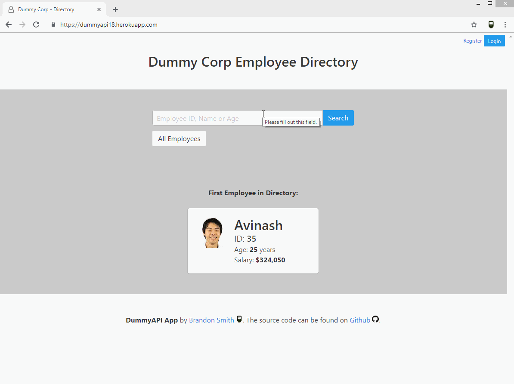

# Dummy API App: Test Application for a public rest API

  

**dummyAPI** is a test app project to practice consuming and manipulating a public example API: **[Dummy API Example](http://dummy.restapiexample.com/)**.

### Features:

- Search and Sort views for the example employee database
- Authentication system (Register, Log-In, Variable Views)
- CRUD operations
- Django Framework
- Bulma CSS Framework
- Pytest & Coverage testing
- Profile Images from [Random User Generator](https://randomuser.me/)

#### To setup locally:

1. Clone the repo to your local machine
2. `cd dummyAPI`
3. `python3 virtualenv venv` (virtualenv name is variable. Current python version is **3.6.1**)
4. Activate the virtual environment and then: `pip install -r requirements.txt`
5. `python manage.py migrate && python manage.py createsuperuser` (Follow the prompts)
6. And you're good to go! `python manage.py runserver` (Should be running on **localhost:8000**)

---

### Examples

**REGISTRATION**:

---

**AUTHENTICATION DIFFERENCES**:

---

> This site was made largely to experiment with and understand different aspects of the Django web framework and public API interaction, and thus not all best practices were adhered to. I welcome any input that could help optimize this codebase. Thank you.
